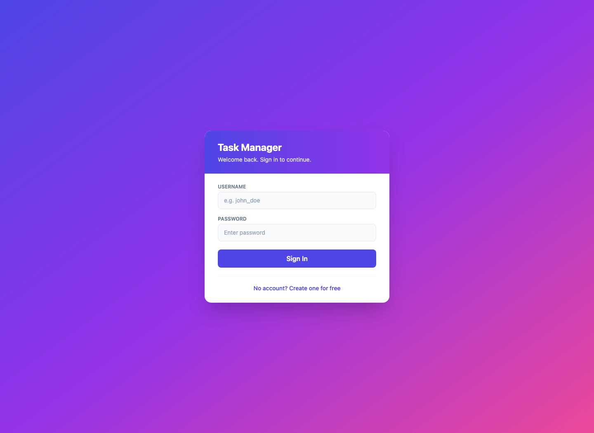
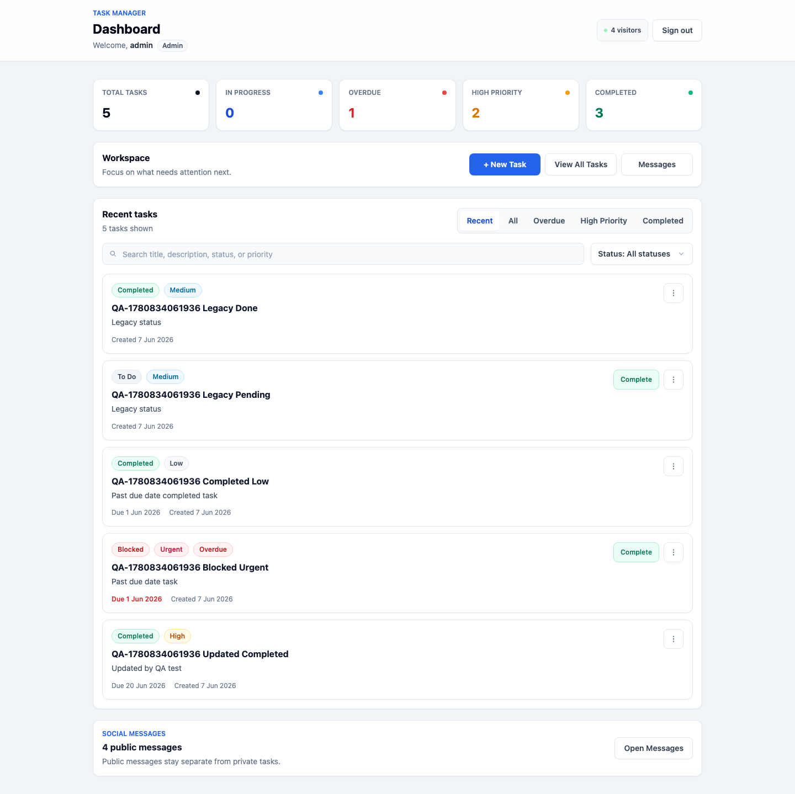
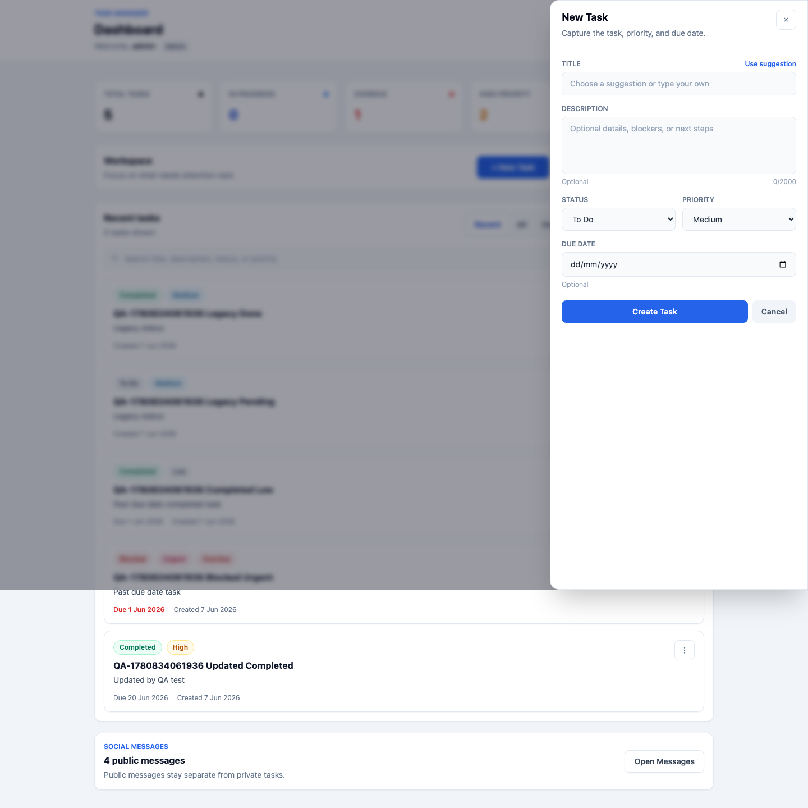

# Task Manager

[](https://github.com/uttamkumar37/task-manager/actions/workflows/ci.yml)


A full-stack Task Manager built with Spring Boot, React, PostgreSQL, JWT authentication, and Docker Compose. Users can register, sign in, manage only their own tasks, track priority and due dates, and leave public social messages without mixing public data into private task data.

## Screenshots

| Login | Dashboard |
| --- | --- |
|  |  |

| Task Drawer |
| --- |
|  |

## Tech Stack

- **Backend:** Spring Boot 3.3.4, Java 17, Spring Security, JPA/Hibernate
- **Database:** PostgreSQL 15
- **Authentication:** Stateless JWT bearer tokens
- **Frontend:** React 18, Vite, Axios, React Router, Tailwind CSS
- **Deployment:** Docker Compose with PostgreSQL, backend, and frontend services
- **CI:** GitHub Actions for backend tests, frontend build, and Compose validation

## Key Features

- JWT-based register/login flow with `Authorization: Bearer <token>`
- Ownership-based task security: authenticated users only see and manage their own tasks
- PostgreSQL persistence for tasks, visitor count, and public/social messages
- Modern React dashboard with summary cards and progressive disclosure
- Task statuses: `TODO`, `IN_PROGRESS`, `BLOCKED`, `WAITING_REVIEW`, `COMPLETED`, `CANCELLED`
- Priority levels: `LOW`, `MEDIUM`, `HIGH`, `URGENT`
- Optional due dates with overdue detection
- Recent task preview, search, status filtering, overdue view, and high-priority view
- Drawer-based create/edit task form with title suggestions
- Compact task cards with quick completion and a More action menu
- Public social message panel collapsed by default on the dashboard
- Docker Compose setup for local full-stack runs
- GitHub Actions CI workflow

## Demo Login

For local development, the backend seeds a default admin user unless overridden by environment variables.

```text
Username: admin
Password: admin123
```

Environment overrides:

```bash
TASK_MANAGER_AUTH_USERNAME=myuser
TASK_MANAGER_AUTH_PASSWORD=mypassword
TASK_MANAGER_AUTH_ROLE=ROLE_ADMIN
```

## Run With Docker Compose

Copy the safe example environment file and adjust values if needed:

```bash
cp .env.example .env
```

Start the full stack:

```bash
docker compose up -d --build
```

Default local URLs:

- Frontend: `http://localhost:5173`
- Backend: `http://localhost:8080`
- PostgreSQL: `localhost:5432`

Useful Docker commands:

```bash
docker compose ps
docker compose logs -f
docker compose down
```

To run on custom ports, set env values before starting Compose:

```bash
BACKEND_PORT=28080 \
FRONTEND_PORT=25173 \
VITE_API_BASE_URL=http://localhost:28080 \
TASK_MANAGER_CORS_ALLOWED_ORIGINS=http://localhost:25173 \
docker compose up -d --build
```

## Local Development

### Backend

```bash
cd backend
mvn spring-boot:run
```

Backend runs at `http://localhost:8080` by default.

### Frontend

Create `frontend/.env`:

```env
VITE_API_BASE_URL=http://localhost:8080
```

Then run:

```bash
cd frontend
npm install
npm run dev
```

Frontend runs at `http://localhost:5173` by default.

## Authentication Flow

This project uses stateless JWT authentication, not server sessions.

- `POST /api/auth/register` creates a new `ROLE_USER`.
- `POST /api/auth/login` returns a JWT as `token`.
- The frontend stores the JWT in `localStorage`.
- Axios attaches the JWT as `Authorization: Bearer <token>`.
- Protected task APIs require a valid token.
- Task queries are scoped to the authenticated username.
- `POST /api/auth/logout` clears the local JWT on the client.

## API Overview

Auth endpoints:

- `POST /api/auth/register`
- `POST /api/auth/login`
- `POST /api/auth/logout`
- `GET /api/auth/me`

Protected task endpoints:

- `GET /api/tasks`
- `GET /api/tasks/{id}`
- `GET /api/tasks?status={status}`
- `GET /api/tasks/search?keyword={keyword}`
- `GET /api/tasks/stats`
- `POST /api/tasks`
- `PUT /api/tasks/{id}`
- `PATCH /api/tasks/{id}/complete`
- `PATCH /api/tasks/{id}/pending`
- `DELETE /api/tasks/{id}`

Task payload fields:

- `title`: required, minimum 3 characters
- `description`: optional, maximum 2000 characters
- `status`: `TODO`, `IN_PROGRESS`, `BLOCKED`, `WAITING_REVIEW`, `COMPLETED`, or `CANCELLED`
- `priority`: `LOW`, `MEDIUM`, `HIGH`, or `URGENT`; defaults to `MEDIUM`
- `dueDate`: optional ISO date, for example `2026-06-30`

Legacy status compatibility:

- `PENDING` maps to `TODO`
- `DONE` maps to `COMPLETED`

Public/social endpoints:

- `GET /api/public/visitors`
- `POST /api/public/visitors/register`
- `POST /api/public/messages`
- `GET /api/messages` for authenticated users

Admin users can see all messages. Regular users see messages submitted while authenticated as themselves.

## Quick API Check

```bash
TOKEN=$(curl -s -X POST http://localhost:8080/api/auth/login \
  -H "Content-Type: application/json" \
  -d '{"username":"admin","password":"admin123"}' | jq -r '.token')

curl -i http://localhost:8080/api/tasks \
  -H "Authorization: Bearer ${TOKEN}"
```

## Tests And Builds

Backend:

```bash
cd backend
mvn test
mvn clean package
```

Frontend:

```bash
cd frontend
npm ci
npm run build
```

Docker validation:

```bash
docker compose config
```

## Continuous Integration

GitHub Actions runs on pushes and pull requests to `main`.

The CI workflow validates:

- Backend tests with `mvn test`
- Frontend install/build with `npm ci` and `npm run build`
- Docker Compose configuration with `docker compose config`

CI uses safe dummy environment values and does not require real secrets. Backend tests use the repository test configuration, so `mvn test` does not require a local PostgreSQL server.

## Known NPM Audit Note

`npm audit` currently reports known moderate dev-tooling vulnerabilities in Vite/esbuild. They are tracked separately because the available npm fix requires a breaking major Vite upgrade. The project intentionally avoids `npm audit fix --force` until that upgrade can be tested safely.

## Future Improvements

- Add end-to-end tests for login, task creation, filters, and social messages
- Add pagination or infinite scroll for large task lists
- Add task labels or project grouping
- Add profile settings and password change flow
- Add production database migrations with Flyway or Liquibase
- Add refresh-token or token-rotation support for longer-lived sessions
- Add deployment-specific screenshots and live demo links

## Notes

- Backend-specific details are in `backend/README.md`.
- Frontend-specific details are in `frontend/README.md`.
- Production secrets should be provided through environment variables, not committed files.
